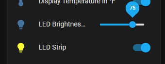
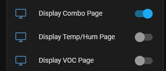

# AirGradient ESPHome Configurations

ESPHome yaml files for an AirGradient DIY devices to send data to HomeAssistant and AirGradient servers while maintaining a similar functionality and look to the official AirGradient Arduino IDE sketch

## Features

Many added features can be found in HomeAssistant by going to Settings>Devices and selecting the AirGradient device.  Alternatively, add `web_server:` to the config file to enable a built-in web server on the AirGradient device (No recommended for devices based on the D1 Mini ESP8266)

- Button to initate a SenseAir S8 CO2 Calibration on demand
  
- Buttons to enable or disable SenseAir S8 CO2 sensor Automatic Baseline Calibration (ABC)
  
- Button to view the current S8 ABC interval (confirm if ABC is disabled or enable, which defaults to every 7 days) View ESPHome logs to see the output of this button
  
- Switch to disable LED output on AirGradient ONE model
- Brightness slider to adjust intensity of AirGradient ONE LED
  
- Switch to toggle display between Fahrenheit and Celsius and persist between reboots
  
- Switch to enable or disable uploading to AirGradient Dashboard via API (Choose to keep data local or also send to AirGradient)
  
- Utilize hardware configuration buttons on AirGradient Pro v3.7 and higher
  - Short press (Less than 1 second) - Toggle between F and C on display
  - Long press (More than 1 second, less than 5) - Trigger manual CO2 calibration
- Enable different pages of information to be shown on the OLED display, or leave the default of a single page with all relevant information
  
- Leverage automations in HomeAssistant to turn on the "Blank" page and turn off all other pages to effectively disable the display output.  Could also turn off the LED strip or set Brightness to 0 to eliminate output while still collecting sensor data

## Configuration

If all original sensors (PMS5003, Senseair S8, SHT4x) are connected, configuration files should be ready
If some sensors are not installed, comment or remove the associated sections under `packages:`

To add your wifi SSID and password, add your SSID and password information, per ESPHome specifications

```yaml
wifi:
  ssid: NachoWiFi
  password: 123456123456
```

## Installation

Copy the .yaml files and any associated fonts or secrets.yaml files to the config folder in your ESPHome installation.

Alternatively, save the .bin file and go to [https://web.esphome.io/](https://web.esphome.io/) in your browser to connect your ESP device and send the .bin file to it, without having ESPHome installed

## Todo list

Several more features are planned to be added to this repo

- Support for Open Air without CO2 sensor
- Explore options for disabling display/LED during certain times (May be deffered to HomeAssistant Automations)
- Add Display page to show all relevant information in a single page
- - https://forum.airgradient.com/t/airgradient-one-customized-mallocarray-esphome-display/1328
- Standardize font on AirGradient Basic display to match Pro
- Add GitHub actions to automatically build updated .bin files as needed
